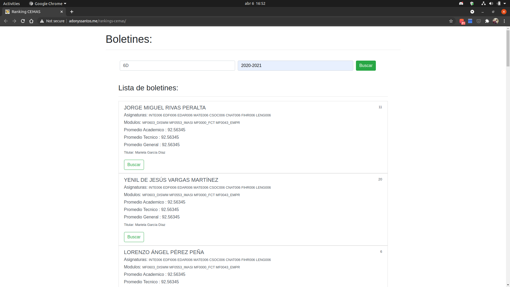

# Introducción

Este es un proyecto escolar grupal, que consiste en crear una App con React, Bootstrap y Firebase. Se requiere ordenar el listado de estudiantes según su calificación promedio. Todos estos datos son obtenidos desde un JSON con un reporte de los restudiantes del centro.

Este proyecto esta hecho con [Create React App](https://github.com/facebook/create-react-app).


## Capturas de pantalla



## Scripts

En este proyecto puedes correr los siguientes Scripts:

### `yarn install` o `npm install`

Para instalar los módulos necesarios de Node.

### `yarn start` o ``npm start``

Ejecuta la aplicación en el modo de desarrollo. \
Abra [http://localhost:3000](http://localhost:3000) para visualizarlo en el navegador.

La página se recargará si realiza modificaciones. \
También verá cualquier error por la consola.

### `yarn run predeploy` o `npm run predeploy`

Construye la aplicación para producción en la carpeta `build`. \
Agrupa correctamente React en el modo de producción y optimiza la compilación para obtener el mejor rendimiento.

La compilación se minimiza y los nombres de archivo incluyen los hash. \
¡Tu aplicación está lista para salir a producción!

Para mas información visita la sección [deployment](https://facebook.github.io/create-react-app/docs/deployment). 

### `yarn run deploy` o `npm run deploy`

Publica la aplicación usando GH Pages.

<!-- 
## Firebase

Aquí va la explicación de como conectar la DB. 
-->

## Contribución

1. Crea un Fork del repositorio.
2. Clonar en tu maquina mediante `git clone url_del_repositorio_fork`.
3. Crear una nueva rama con el nombre de tu feature.
4. Realiza tus cambios.
5. Manda tu pull request a la rama `pre-production`.

## Mantener actualizado tu Fork

Una vez tenga clonado el repositorio Fork en tu PC, lo primero que tienes que hacer es crear un remoto al repositorio principal usando: `git remote add upstream https://github.com/adonyssantos/rankings-cemas.git`. **(Esto solo lo tienes que hacer una vez).**

Luego cada vez que se haga un cambio en el repositorio principal y lo quieras traer a tu fork usa los siguientes comandos:

1. `git pull upstream main`
2. `git push origin main`

**Nota:** recuerda estar ubicado dentro de la rama que quieres actualizar.

Aquí unos enlaces con información que podria serte util:
1. https://docs.github.com/en/github/collaborating-with-issues-and-pull-requests/configuring-a-remote-for-a-fork#platform-linux
2. https://docs.github.com/en/github/collaborating-with-issues-and-pull-requests/syncing-a-fork#platform-linux

 ## El primer paso del algoritmo es obtener los reportes por curso y periodo:      
 `4A:2020-2021`
 
 ### Para llevar acabo la peticion de los reportes debemos usar: 
 #### La funcion para crear la URL que solicita los reportes al API: 
 La siguiente funcion nos sirve para formar la URL para el pedido de reportes: 
 ```js
 const getReportsURL = (curso, periodo) => {

	/**
	 * @description: Obtener todos los reportes por curso y periodo. 
	 * @param	{String}	curso Ejemplo: "4A"
	 * @param	{String}	Periodo Ejemplo: "2020-2021"
	 * @URL https://cemasapi.herokuapp.com/reportes/boletin/4A:2020-2021:
	 * @return  {String}	URL	 String URL .
	 */
...
};
 ```
 
#### El hook para gestionar los fecth al API:

El hook que creamos es `useFetch`
```js
import { useState, useEffect, useRef } from 'react';


export const useFetch = (url) => {
...
}
```

#### El componente que hace la peticion y usa el useFetch:

```js
import { useFetch } from "../hooks/useFetch";
import ItemBoletin from "./ItemBoletin";


export default function ListaBoletines({ url }) {
...
}
```

## Informaciones de los reportes y las metodologias utilizadas

Los reportes se realizan para documentar todo lo que se hace en las reuniones, las tareas u otras actividades relacionadas con el proyecto.

**Estructura de los reportes**

* Nombre y numero del reporte.
* Descripcion del reporte.
* Detalles de la reunion.
* Logros y observaciones.
* Participacion de los estudiantes (Evidencias).
* Evidencias de todo el proceso del dia. 


